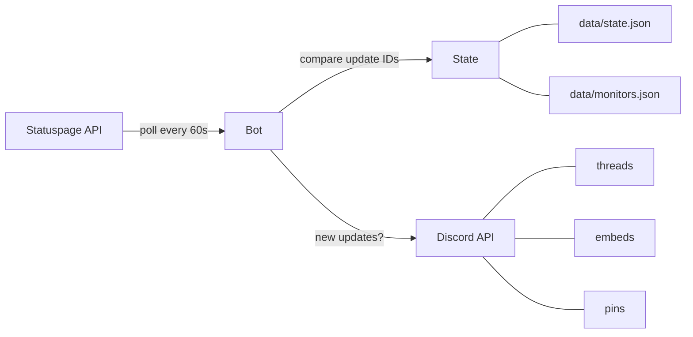

# Architecture

## Overview

statuspage-discord is a single-file TypeScript application (`src/index.ts`, ~1700 lines) that runs on the [Bun](https://bun.sh) runtime. It connects to Discord via [discord.js](https://discord.js.org/) and polls public Statuspage.io API endpoints on a timer.

## Data Flow

1. Every `POLL_INTERVAL_MS` (default 60s), the bot fetches `/api/v2/incidents.json` for each monitor
2. Compares returned update IDs against `monitorState.postedUpdateIds`
3. For each unseen update: ensures a thread exists, posts the update embed, syncs the parent message
4. Reconciles `openIncidentIds` against the API to detect vanished incidents
5. Persists updated state to `data/state.json`

## Module Structure

The single source file is organized into these logical sections:

| Section | Lines (approx.) | Purpose |
|---------|-----------------|---------|
| Imports & Validation | 1-100 | Zod schemas, env parsing, monitor loading |
| Types | 100-240 | TypeScript interfaces for API responses and state |
| Command Builders | 240-350 | Slash command definitions (dynamic via feature flags) |
| State I/O | 350-410 | Read/write `state.json` with migration support |
| API Client | 410-435 | Fetch wrappers for Statuspage endpoints |
| UI Rendering | 435-700 | Embed builders for status, incidents, updates, ghosts |
| Replay Logic | 700-880 | Incident timeline replay and deduplication |
| Autocomplete | 880-910 | Monitor autocomplete for slash commands |
| Command Registration | 910-920 | Discord REST API command push |
| Thread Management | 970-1110 | Thread creation, parent sync, self-healing |
| Missing Incident Handler | 1110-1190 | Ghost detection and strikethrough rendering |
| Polling Core | 1190-1260 | Main poll loop with open incident tracking |
| Command Handlers | 1260-1610 | /status, /replay, /testpost, /clean, /monitor |
| Main Entry | 1610-1700 | Client setup, event handlers, login |

## Key Design Decisions

### Single File
All logic lives in one file for simplicity. The bot is small enough that splitting into modules would add overhead without meaningful benefit.

### Polling Over Webhooks
Statuspage.io supports webhooks, but polling is simpler to deploy (no public endpoint needed) and works behind NATs/firewalls. The trade-off is a ~60s update delay.

### Thread-Per-Incident
Each incident gets its own Discord thread hanging off a "parent" embed in the channel. This keeps the main channel clean while preserving full timelines.

### Server-Side Open Incident Tracking
The bot maintains an `openIncidentIds` array in state to reliably detect when incidents vanish from the API. This prevents false ghosting of incidents the bot never saw as "open".

### Self-Healing State
When Discord messages or threads are manually deleted, the bot detects missing resources (via DiscordAPIError codes 10003, 10008, 50001) and cleans up its state rather than crashing.

## Dependencies

| Package | Purpose |
|---------|---------|
| `discord.js` | Discord gateway + REST API |
| `zod` | Runtime validation for env vars and API payloads |

Dev-only: `typescript`, `@types/bun`.

## Error Handling Strategy

- **Zod validation** at startup catches misconfigured environment variables immediately
- **API errors** are caught per-monitor so one failing page doesn't block others
- **Discord API errors** with known codes (Unknown Channel, Unknown Message, Missing Access) trigger state cleanup instead of crashes
- **Transient errors** (network timeouts) are logged and retried on the next poll cycle
- **Interaction errors** are sent as ephemeral replies to the user
