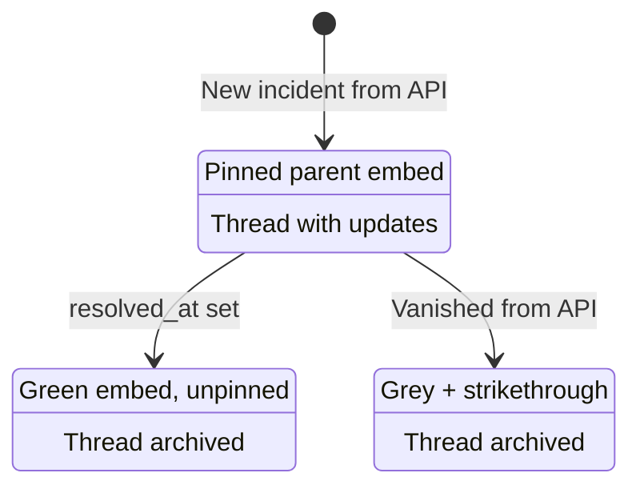

# Incident Lifecycle

This page describes how incidents move through their lifecycle from the bot's perspective.

## States

### Active

- **Trigger:** A new incident appears in the status page API with no `resolved_at` timestamp
- **Discord actions:**
  - Parent embed posted in the monitor channel (color-coded by impact)
  - Parent message pinned
  - Thread created off the parent message (named after the incident, 1-week auto-archive)
  - Each update posted as an embed in the thread
- **State:** Tracked in `monitorState.incidents[incidentId]` with `resolvedAt: undefined`
- **Open tracking:** Incident ID added to `monitorState.openIncidentIds`

### Updating

- **Trigger:** New entries appear in `incident.incident_updates` that weren't previously posted
- **Discord actions:**
  - Thread unarchived if it was archived
  - Update embed posted in the thread (color-coded by the update's own status, not the incident's current status)
  - Parent embed re-rendered with latest update body, status, and timestamp
- **State:** Update IDs appended to both `incidentState.postedUpdateIds` and `monitorState.postedUpdateIds`

### Resolved

- **Trigger:** Incident gains a `resolved_at` timestamp in the API
- **Discord actions:**
  - Parent embed updated (green color, "Resolved" footer)
  - Parent message unpinned
  - Thread archived with reason "Incident resolved"
- **State:** `incidentState.resolvedAt` set; incident ID removed from `openIncidentIds`

### Removed (Ghosted)

- **Trigger:** An incident the bot tracked as "open" (via `openIncidentIds` or unresolved in state) disappears from the API entirely
- **Discord actions:**
  - Parent embed replaced with grey, strikethrough version: `~~Incident Name~~`
  - All update embeds in the thread are greyed out with strikethrough text
  - Parent message unpinned
  - Thread archived
- **State:** `incidentState.resolvedAt` set to current time
- **Design rationale:** Deleted incidents are preserved in Discord for audit purposes. The strikethrough + grey styling makes it clear the incident was removed rather than resolved normally.

### Already-Resolved Ghost Skip

If an incident was resolved (green embed) before it aged out of the API window, the bot detects the resolved color on the parent embed and simply marks it as resolved in state without re-rendering. The parent message is also unpinned if still pinned (safety net for cases where the resolution-path unpin failed). This prevents resolved incidents from being unnecessarily ghosted.

## Open Incident Tracking

The bot maintains a server-side `openIncidentIds` array per monitor:

1. On each poll, the bot compares `openIncidentIds` against the API response
2. Incidents present in `openIncidentIds` but missing from the API are candidates for ghosting
3. After processing, `openIncidentIds` is rebuilt from the API's current unresolved incidents
4. This prevents false ghosting of incidents the bot never knew about (e.g., incidents that appeared and resolved between polls)

## Thread Lifecycle

| Event | Thread Action |
|-------|--------------|
| New incident | Created, auto-archive = 1 week |
| New update on archived thread | Unarchived |
| Incident resolved | Archived |
| Incident removed from API | Archived |
| `/replay` on archived thread | Temporarily unarchived, re-archived if resolved |
| `/clean` | Thread deleted entirely |

## Self-Healing

The bot handles situations where Discord state diverges from bot state:

- **Thread deleted manually:** Bot detects `DiscordAPIError` (10003 Unknown Channel), cleans up state, creates a new thread on next update
- **Parent message deleted:** Same detection, re-creates parent + thread
- **Messages deleted from thread:** `/replay` detects missing update IDs by scanning thread footers, re-posts only missing updates
- **Bot lacks access:** Error code 50001 triggers state cleanup for that incident
